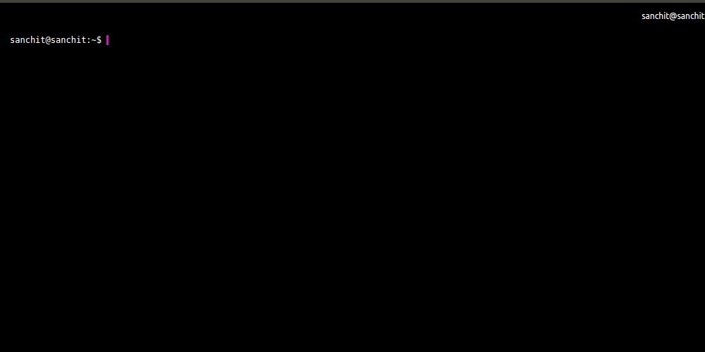

npm-compare
-----------



Compare npm packages from your terminal.

Inspired from [npmcompare.com](https://npmcompare.com/) | Using [npms.io api](https://npms.io/)

## Installation

```
npm install --global npm-compare
```

## Usage

```
npm-compare [ <package_name> ]
```

### Example

`npm-compare express connect`
